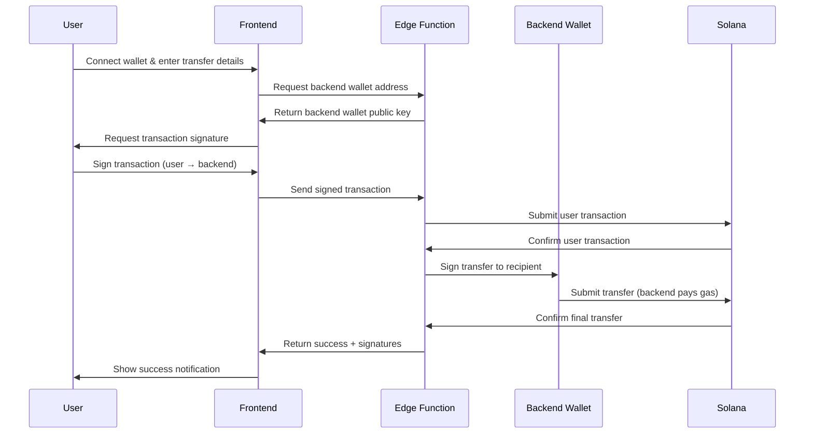

# Gasless Transfer DApp

A Solana-based decentralized application that enables token transfers without requiring users to pay gas fees.

## 🚀 Features

- **Zero Gas Fees**: Backend wallet covers all network transaction fees
- **0.5% Service Fee**: Transparent, flat-rate pricing
- **Multi-Wallet Support**: Phantom and Solflare wallet integration
- **Real-time Validation**: Live fee calculation and minimum amount checking ($5 USD)
- **Production Ready**: Full Solana blockchain integration with Web3.js
- **Beautiful UI**: Modern, responsive design with glassmorphism effects

## 🏗️ Architecture

### Frontend
- **React** + **TypeScript** + **Vite**
- **Tailwind CSS** for styling
- **shadcn/ui** component library
- **@solana/wallet-adapter** for wallet connections
- **@solana/web3.js** for blockchain interactions

### Backend
- **Lovable Cloud** (Supabase Edge Functions)
- **Deno** runtime for serverless functions
- **Solana Web3.js** for transaction handling
- Automated transaction relay system

## 📋 How It Works



## 🔧 Setup & Deployment

See [DEPLOYMENT.md](./DEPLOYMENT.md) for complete production deployment instructions.

### Quick Start

1. **Generate Backend Wallet**
   ```bash
   node scripts/generateWallet.js
   ```

2. **Configure Secrets**
   - Set `BACKEND_WALLET_PRIVATE_KEY` in Lovable Cloud
   - Value should be a JSON array of 64 numbers

3. **Fund Backend Wallet**
   - Devnet: `solana airdrop 2 <PUBLIC_KEY> --url devnet`
   - Mainnet: Transfer SOL from an exchange

4. **Test Transfer**
   - Connect wallet in the DApp
   - Send a small test amount
   - Verify transaction on Solscan

## 💰 Economics

### Cost Breakdown
- **Gas Fee per Transaction**: ~0.000005 SOL (~$0.0005)
- **Service Fee**: 0.5% of transfer amount
- **Example**: 1 SOL transfer = 0.005 SOL service fee ($0.50)

### Profitability
- Net profit per transaction: Service fee - Gas fee
- Break-even: Very low volume due to minimal Solana fees
- 1000 transactions/day: ~$500 revenue, ~$0.50 costs

## 🛡️ Security

- ✅ Private keys stored in secure secrets management
- ✅ Input validation on all user inputs
- ✅ Wallet address verification
- ✅ Transaction signature validation
- ✅ Minimum transfer amount enforcement
- ✅ Atomic transaction flow (no partial failures)

## 📊 Monitoring

The DApp includes built-in monitoring:
- **Network Status**: Live Solana block height
- **Backend Wallet Balance**: Real-time SOL balance tracking
- **Transaction Logging**: All transfers logged to console
- **Error Tracking**: Comprehensive error handling

Set up alerts for:
- Backend wallet balance < 0.1 SOL
- High error rate
- Unusual transaction patterns

## 🔌 API Reference

### Edge Function Endpoints

**Get Backend Wallet**
```javascript
POST /functions/v1/gasless-transfer
{
  "action": "get_backend_wallet"
}

Response:
{
  "publicKey": "BACKEND_WALLET_ADDRESS",
  "message": "Backend wallet public key retrieved"
}
```

**Relay Transfer**
```javascript
POST /functions/v1/gasless-transfer
{
  "action": "relay_transfer",
  "signedTransaction": "BASE64_ENCODED_TRANSACTION",
  "recipientPublicKey": "RECIPIENT_ADDRESS",
  "amountAfterFee": 0.995
}

Response:
{
  "success": true,
  "signatures": {
    "userToBackend": "USER_TX_SIGNATURE",
    "backendToRecipient": "BACKEND_TX_SIGNATURE"
  },
  "backendWalletBalance": 1.5,
  "message": "Gasless transfer completed successfully"
}
```

## 🚦 Network Configuration

**Current**: Solana Mainnet Beta
- RPC: `https://api.mainnet-beta.solana.com`
- Explorer: https://solscan.io

**For Testing**: Switch to Devnet
- RPC: `https://api.devnet.solana.com`
- Free SOL from faucet

## 📈 Future Enhancements

- [ ] SPL token support (USDC, USDT, etc.)
- [ ] Transaction history tracking
- [ ] User authentication
- [ ] Admin dashboard
- [ ] Real-time SOL price oracle
- [ ] Rate limiting
- [ ] Advanced analytics

## 🤝 Contributing

Built with [Lovable](https://lovable.dev) - AI-powered full-stack development platform.

## 📚 Resources

- [Solana Documentation](https://docs.solana.com)
- [Solana Web3.js Guide](https://solana-labs.github.io/solana-web3.js/)
- [Lovable Cloud Docs](https://docs.lovable.dev/features/cloud)
- [Deployment Guide](./DEPLOYMENT.md)

## ⚠️ Important Notes

1. **Backend Wallet Balance**: Monitor regularly and maintain sufficient SOL
2. **Rate Limiting**: Consider implementing to prevent abuse
3. **Premium RPC**: Use a dedicated RPC provider for production (Helius, QuickNode)
4. **Security**: Never expose private keys in logs or client-side code
5. **Testing**: Thoroughly test on devnet before mainnet deployment

## 📝 License

MIT License - Feel free to use and modify for your projects.

---

Built with ❤️ using Lovable Cloud & Solana
